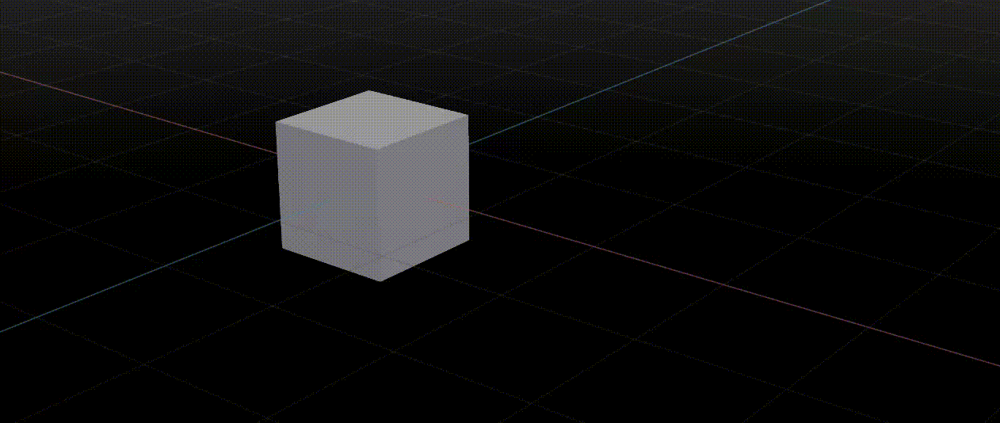

# Omniverse USD Keyframe Animation Generation

This short tutorial demonstrates the use of USD API to generate keyframe animations for Omniverse.

## End Result

At the end of this tutorial, you will get a cube that moves from origin to another point and back, as seen in the following GIF:




## Step-by-Step Instructions

We start by creating a new USD stage and configurate the relevant metadata

```
from pxr import Usd, UsdGeom, Gf, Sdf

stage = Usd.Stage.CreateNew('keyframe.usda')

stage.DefinePrim('/World', 'Xform')

stage.SetMetadata('defaultPrim', 'World')
stage.SetMetadata('startTimeCode', 0)
stage.SetMetadata('endTimeCode', 100)
stage.SetMetadata('timeCodesPerSecond', 60)
stage.SetMetadata('metersPerUnit', 0.01)
stage.SetMetadata('upAxis', 'Y')
```

We then define a cube as the target of animation

```
target_prim_path = '/World/Cube'
cube_extent = [(-50, -50, -50), (50, 50, 50)]
cube_size = 100
initial_rotation = (0, 0, 0)
initial_scale = (1, 1, 1)
initial_translation = (0, 0, 0)

cube_prim = UsdGeom.Cube.Define(stage, target_prim_path).GetPrim()

cube_prim.CreateAttribute('extent', Sdf.ValueTypeNames.Float3Array).Set(cube_extent)
cube_prim.CreateAttribute('size', Sdf.ValueTypeNames.Double).Set(cube_size)
cube_prim.CreateAttribute('xformOp:rotateXYZ', Sdf.ValueTypeNames.Double3).Set(initial_rotation)
cube_prim.CreateAttribute('xformOp:scale', Sdf.ValueTypeNames.Double3).Set(initial_scale)
cube_prim.CreateAttribute('xformOp:translate', Sdf.ValueTypeNames.Double3).Set(initial_translation)
cube_prim.CreateAttribute('xformOpOrder', Sdf.ValueTypeNames.TokenArray).Set([
    'xformOp:translate', 'xformOp:rotateXYZ', 'xformOp:scale'
])
```

Next, we create an OmniGraph with a GraphNode that defines the animation curve

```
og_prim = stage.DefinePrim('/World/PushGraph', 'OmniGraph')

og_prim.CreateAttribute('evaluationMode', Sdf.ValueTypeNames.Token).Set('Automatic')
og_prim.CreateAttribute('evaluator:type', Sdf.ValueTypeNames.Token).Set('push')
og_prim.CreateAttribute('fabricCacheBacking', Sdf.ValueTypeNames.Token).Set('Shared')
og_prim.CreateAttribute('fileFormatVersion', Sdf.ValueTypeNames.Int2,).Set(Gf.Vec2i(1, 6))
og_prim.CreateAttribute('pipelineStage', Sdf.ValueTypeNames.Token).Set('pipelineStageSimulation')

node_prim = stage.DefinePrim('/World/PushGraph/CubeCurveNode', 'OmniGraphNode')

node_prim.CreateRelationship('inputs:Prim').SetTargets([target_prim_path])
node_prim.CreateAttribute('inputs:Time', Sdf.ValueTypeNames.TimeCode,).Set(Sdf.TimeCode(0))
node_prim.CreateAttribute('inputs:UseGlobalTime', Sdf.ValueTypeNames.Bool).Set(True)
node_prim.CreateAttribute('node:type', Sdf.ValueTypeNames.Token).Set('omni.anim.curve.AnimCurve')
node_prim.CreateAttribute('node:typeVersion', Sdf.ValueTypeNames.Int).Set(5)
```

Finally, we populate the GraphNode with the relevant keyframe data

```
'''
We want the x-axis of the cube to be 0 at first keyframe, 200 at second keyframe
# and back to 0 at the third keyframe
'''
x_axis_values = [0, 200, 0]


'''
TODO: can someone help me make sense of these values for times?
I have set the second keyframe to be at frame 50 and third to be at frame 100
and the results I get in USD are 117600000 and 235200000 respectively.
How do we get from the frame number to those values?
'''
keyframe_times = [0, 117600000, 235200000]


node_prim.CreateAttribute('xformOp:translate:x:defaultTangentType', Sdf.ValueTypeNames.Token).Set('auto')
node_prim.CreateAttribute('xformOp:translate:x:inTangentTimes', Sdf.ValueTypeNames.Int64Array).Set([0, 0, -0])
node_prim.CreateAttribute('xformOp:translate:x:inTangentTypes', Sdf.ValueTypeNames.TokenArray).Set(['auto', 'auto', 'auto'])
node_prim.CreateAttribute('xformOp:translate:x:inTangentValues', Sdf.ValueTypeNames.DoubleArray).Set([0, 0, 0])
node_prim.CreateAttribute('xformOp:translate:x:outTangentTimes', Sdf.ValueTypeNames.Int64Array).Set([0, 0, 0])
node_prim.CreateAttribute('xformOp:translate:x:outTangentTypes', Sdf.ValueTypeNames.TokenArray).Set(['auto', 'auto', 'auto'])
node_prim.CreateAttribute('xformOp:translate:x:outTangentValues', Sdf.ValueTypeNames.DoubleArray).Set([0, 0, 0])
node_prim.CreateAttribute('xformOp:translate:x:postInfinityType', Sdf.ValueTypeNames.Token).Set('constant')
node_prim.CreateAttribute('xformOp:translate:x:preInfinityType', Sdf.ValueTypeNames.Token).Set('constant')
node_prim.CreateAttribute('xformOp:translate:x:tangentBrokens', Sdf.ValueTypeNames.BoolArray).Set([0, 0, 0])
node_prim.CreateAttribute('xformOp:translate:x:tangentWeighteds', Sdf.ValueTypeNames.BoolArray).Set([0, 0, 0])
node_prim.CreateAttribute('xformOp:translate:x:times', Sdf.ValueTypeNames.Int64Array).Set(keyframe_times)
node_prim.CreateAttribute('xformOp:translate:x:values', Sdf.ValueTypeNames.DoubleArray).Set(x_axis_values)
```

And don't forget to save the USD Stage at the end

```
stage.Save()
```

Note that we have only defined keyframe animation for the x-translation of the cube. Other `xform` attributes can be defined analogously, i.e. change `translate:x` part in the attribute name to `translate:y`, `rotateXYZ:z`, `scale:x`, etc.


The resulting USD file generated from the script should look like this:

```
#usda 1.0
(
    defaultPrim = "World"
    endTimeCode = 100
    metersPerUnit = 0.01
    startTimeCode = 0
    timeCodesPerSecond = 60
    upAxis = "Y"
)

def Xform "World"
{
    def Cube "Cube"
    {
        float3[] extent = [(-50, -50, -50), (50, 50, 50)]
        double size = 100
        custom double3 xformOp:rotateXYZ = (0, 0, 0)
        custom double3 xformOp:scale = (1, 1, 1)
        custom double3 xformOp:translate = (0, 0, 0)
        uniform token[] xformOpOrder = ["xformOp:translate", "xformOp:rotateXYZ", "xformOp:scale"]
    }

    def OmniGraph "PushGraph"
    {
        custom token evaluationMode = "Automatic"
        custom token evaluator:type = "push"
        custom token fabricCacheBacking = "Shared"
        custom int2 fileFormatVersion = (1, 6)
        custom token pipelineStage = "pipelineStageSimulation"

        def OmniGraphNode "CubeCurveNode"
        {
            custom rel inputs:Prim = </World/Cube>
            custom timecode inputs:Time = 0
            custom bool inputs:UseGlobalTime = 1
            custom token node:type = "omni.anim.curve.AnimCurve"
            custom int node:typeVersion = 5
            custom token xformOp:translate:x:defaultTangentType = "auto"
            custom int64[] xformOp:translate:x:inTangentTimes = [0, 0, 0]
            custom token[] xformOp:translate:x:inTangentTypes = ["auto", "auto", "auto"]
            custom double[] xformOp:translate:x:inTangentValues = [0, 0, 0]
            custom int64[] xformOp:translate:x:outTangentTimes = [0, 0, 0]
            custom token[] xformOp:translate:x:outTangentTypes = ["auto", "auto", "auto"]
            custom double[] xformOp:translate:x:outTangentValues = [0, 0, 0]
            custom token xformOp:translate:x:postInfinityType = "constant"
            custom token xformOp:translate:x:preInfinityType = "constant"
            custom bool[] xformOp:translate:x:tangentBrokens = [0, 0, 0]
            custom bool[] xformOp:translate:x:tangentWeighteds = [0, 0, 0]
            custom int64[] xformOp:translate:x:times = [0, 117600000, 235200000]
            custom double[] xformOp:translate:x:values = [0, 200, 0]
        }
    }
}
```
